# Dokumentáció
## The Contacter
Készítette: Tóth Attila

### Description / Leírás:
This repository has been created for the course of 'Alkalmazások fejlesztése' at ELTE University. Here I keep the files of my project organised, and updated.

Ez a repository az ELTE 'Alkalmazások fejlesztése' című kurzushozához jött létre. Az itt található fileok mindig a legfrissebb állást tükrözik.

### 1. Követelményanalízis

#### 1.1 Célkitűzés, információ az alkalmazásról
Az alkalmazás célja az, hogy egy élvezhetően használható, kellemes felületet biztosítson kontaktjaink
kezeléséhez, azok rendezetten tartásához, konktakcsoportok meghatározásához.
Az alkalmazás használatához registráció szükséges.

#####  Funkcionális követelmények

**Vendégként** (*nem regisztrált felhasználó*)
- Vendégként a főoldalon szeretnék egy üdvözlő üzenetet látni
- Vendégként szeretnék egy üdvözlő oldalt látni
- Vendégként szeretnék regisztrációs lehetőséget

**Felhasználóként** (*regisztrált felhasználó*)
- Felhasználóként szeretném a saját kontaktjaimat látni a főoldalon.
- Felhasználóként szeretném a kedvenc kontaktjaimat elsőként látni.
- Felhasználóként szeretnék új kontaktot létrehozi.
- Felhasználóként képet szeretnék tudni csatolni egy-egy kontakthoz.
- Felhasználóként meg szeretnék adni több telefonszámot egy-egy kontakthoz.
- Felhasználóként akár e-mail címet is szeretnék társítani egy-egy kontakthoz.
- Felhasználóként szeretnék egy saját kontaktot.

##### Nem funkcionális követelmények
- **Felhasználóbarát**, ergonomikus elrendezés és kinézet.
- **Gyors** működés.
- **Biztonságos** működés: jelszavak hashének tárolása.
- **Egyszerű**, következetes felhasználói felület, egyszerű használat.
- **Kellemes** kinzet.

#### 1.2 Szakterületi fogalomjegyzék
 
 - **Kontakt**: Egy ismerős adatait reprezentáló objektum, hozzá tartozik kép is telefonszámok is.
 - **Kontakt csoport**: kontakt objektumokból álló csoport.

#### 1.3 Használatiest-modell, funkcionális követelmények

**Vendég**

Csak a főoldalt, és a regisztrációt éri el.

- Főoldal
- Bejelentkezés
- Regisztráció

**Bejelentkezett felhasználó**

A publikus oldalakon kívül ezeket is eléri:

- Új kontakt hozzáadása
- Kontakthoz kép csatolása
- Kontakthoz e-mail cím csatolása
- Kontakthoz telefonszámok csatolása
- Kontakthoz megjegyzés csatolása
- Becenév megadása
- Lakhely beírása

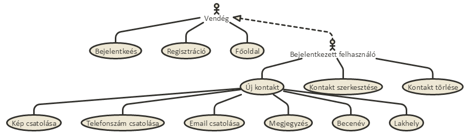

Egy eset bemutatása: ***kontakt hozzáadása***
1. A felhasználó az oldalra érkezve bejelentkezik, vagy regisztrál.
2. A regisztráció után elérhetővé vált menük közül kiíválsztja a kontakt hozzáadását.
3. Ez után az elé kerülő formot kitölti, melynek kötelező eleme csak egy név.
4. (Opcionálisan megad telefonszámot, képet, lakhelyet...)
5. Mentés gombra kattintva véglegesíti az adatokat.

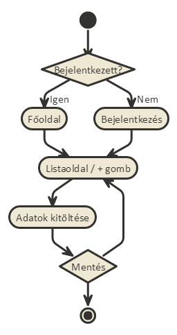

### 2. Tervezés
 
#### 2.1 Architektúra terv
 
##### 2.1.1 Komponensdiagram

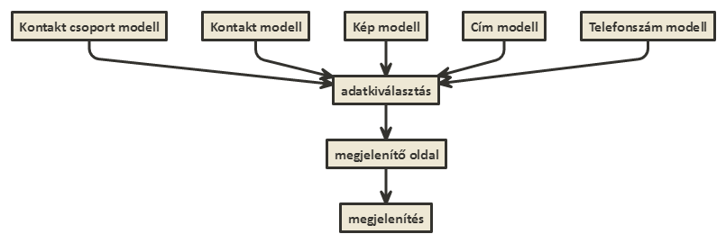
 
##### 2.1.2 Oldaltérkép
 
###### Publikus:
- Főoldal
- Bejelentkezési oldal
- Regisztrációs oldal
 
###### Bejelentkezett felhasználó:
- Főoldal
- Új kontakt hozzáadása
- Listaoldal
    - kontaktcsoportok megjelenítése
    - kontaktok megjelenítése
- Szerkesztő oldalak
    - kontakt szerkesztése
    - kontaktcsoport szerkesztése
- Képfeltöltő oldal

##### 2.1.3 Végpontok

- GET / : Főoldal
- GET,POST /login : Bejelentkezés
- GET,POST /registration : Regisztráció
- GET /contacts : Kontaktok oldal
- GET /contact/contact-url-nev : Kontakt megtekintése
- GET /contacts/groups : Kontaktcsoportok megjelenítése
- GET,POST /contact/new-contact : Kontakt létrehozása
- GET,POST /contact/contact-url-nev : Kontakt szerkesztése

##### 2.2 Felhasználói-felület modell
 
###### 2.2.1 Oldalválzlatok:
 
 A tervektől való esetleges eltérések megeshetnek, ugyan is előfordulhat, hogy szerkesztés közben derül ki, hogy minimális változtatással sokkal esztétikusabb eredményt érhetek el.
 
###### Főoldal
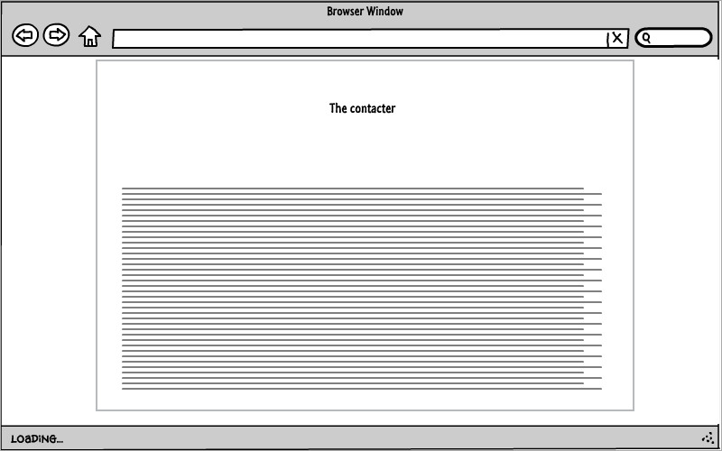
 
###### Regisztrációs oldal

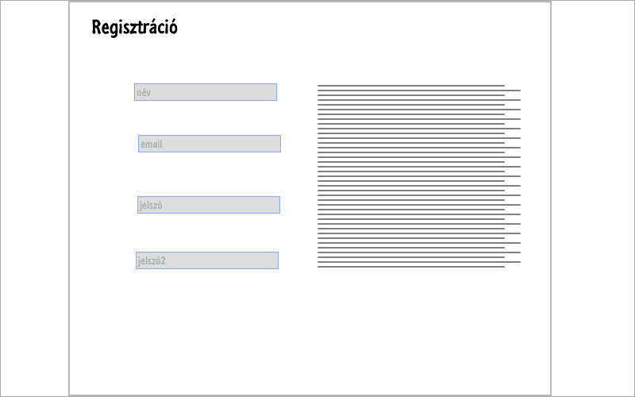
 
###### Bejelentkezés oldal
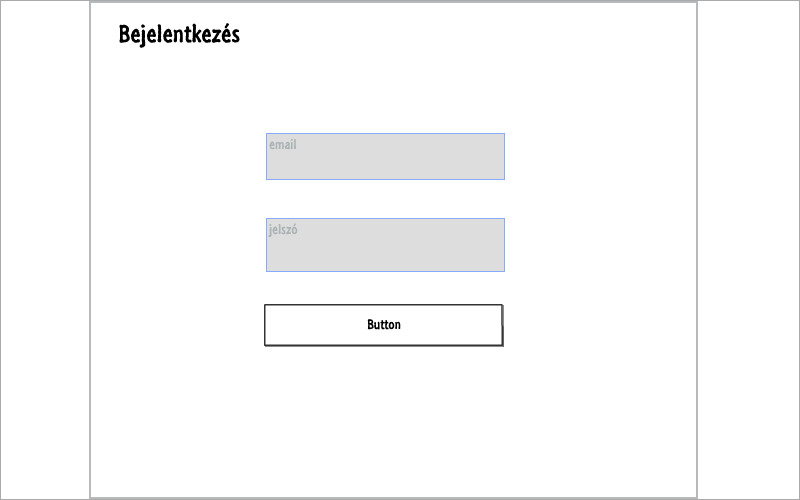
 
###### Kontaktok listázása oldal
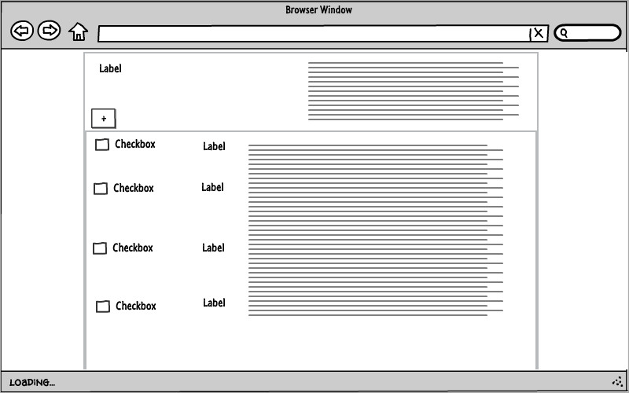
 
###### Kontakt hozzáadása / szerkesztése oldal
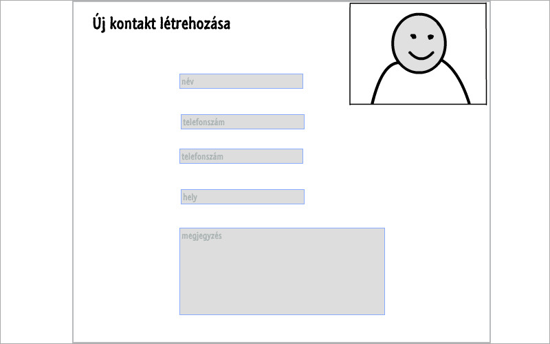
 
##### 2.2.2 Osztálymodell
 
###### Adatmodell
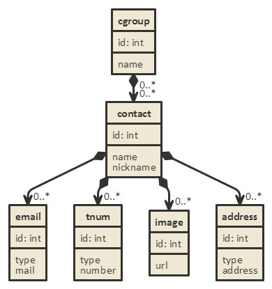

###### Adatbázisterv
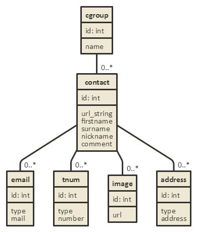
 
###### Szekvenciadiagram

Vegyünk például egy regisztrációt, majd egy új kontakt felvételét, szerkesztését, törlését.
 
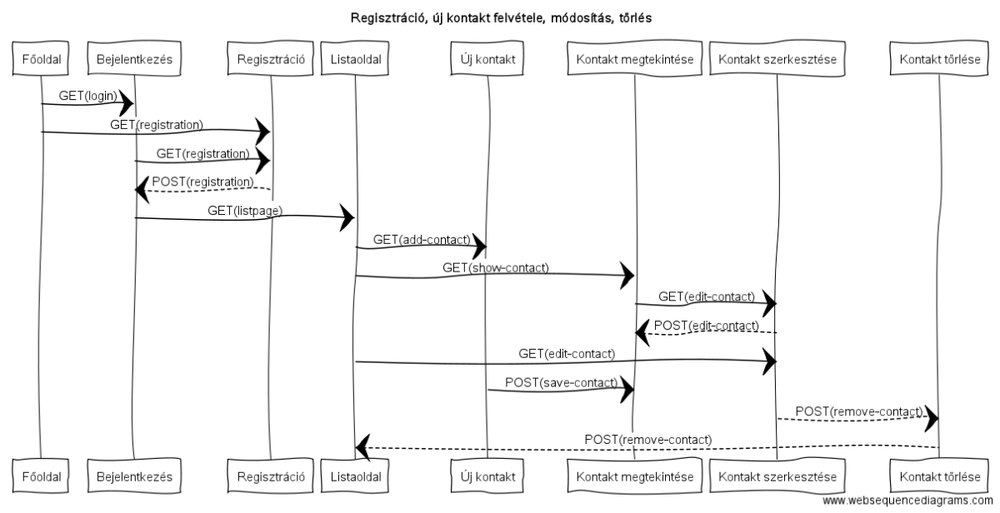

 
### 3. Implementáció

###### 3.1.1 Fejlesztőkörnyezet
 
**PHPStorm**, local IDE

VCS: **git**

**Github** kódtárban tárolom a projekt kódjait.

 
###### 3.1.2 Könyvtárstruktúra
 
 * **the-contacter**
  * **config**
  * **controllers**
    * _HomeController.js_
    * _ContactController.js_
  * **models**
    * _Cgroup.js_
    * _Contact.js_
    * _Image.js_
    * _Address.js_
    * _Tnum.js_
  * **views**:
    * **login**
      * _loginpage.njk_
    * **home**
      * _home.njk_
    * **contact**
      * _add.njk_
      * _list.njk_
    * _master.njk_
  * _bower.json_
  * _package.json_
  * _server.js_

### 4.	Felhasználói dokumentáció

**Futtatáshoz szükséges operációs rendszer:** Tetszőleges operációs rendszer

**A futtatáshoz szükséges hardver:** Operációs rendszerek szerint megadva

**Egyéb követelmények:** Internet böngésző telepítése, JavaScript ajánlott

**Program használata:**

1. Böngészőben nyissuk meg a főoldalt
2. Jelentkezzünk be az oldalra a "Bejelentkezés" gomb segítségével
3. Bejelentkezés/Regisztráció után a Lista oldalra jutunk
4. Oldalt a "+" gombra kattintva tudunk új kontaktot az adatbázishoz adni
5. Töltsük ki az űrlapot
6. Hibás adatok esetén az űrlap jelezni fogja a hibát
7. "Mentés" gombra kattintva mentsük el az adatokat
8. Lista oldalon: "Szerkesztés" gombra kattintva a szerkesztés oldalra jutunk
9. Lista oldalon: Megtekint gombra kattintva a Megtekint oldalra jutunk
10. Megtekintés oldalon található a szerkesztés gomb
11. Szerkesztés oldal: megegyezik az új kontakt oldallal, viszont előre ki van töltve.

### 5.	Irodalomjegyzék:

http://webprogramozas.inf.elte.hu/alkfejl.php

http://ade.web.elte.hu/wabp/lecke2_lap1.html

http://webprogramozas.inf.elte.hu/alkfejl/A_dokumentacio_felepitese.pdf
